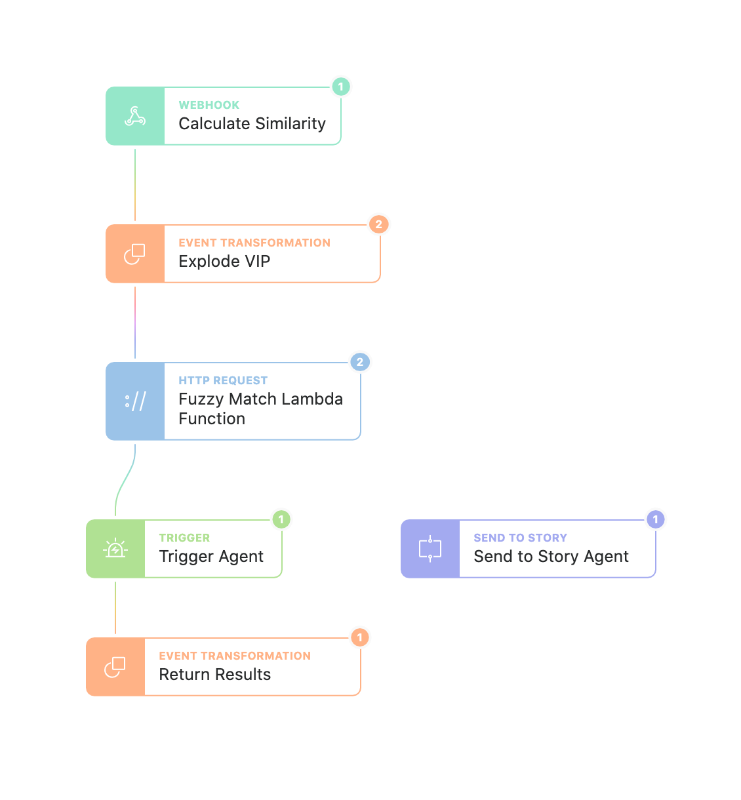

# AWS Lambda 

Tines is incredibly powerful in many ways, but sometimes there is a small feature missing here and there. Not to fret, Tines works well with AWS Lambda so custom functions can be created in order to solve nearly any issue.

This example has a simple packaged AWS Lambda function that will calculate the [Levenshtein distance](https://en.wikipedia.org/wiki/Levenshtein_distance) between two strings in order to look for potentially spoofed email senders. Tines will call the Lambda function and be able to use the resulting data in the workflow.

