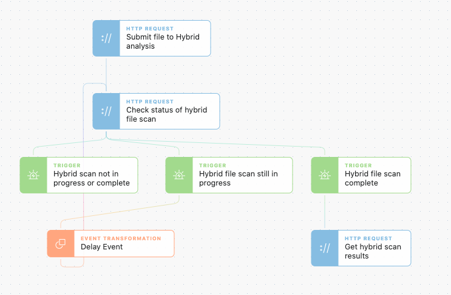

# Loops

It is common for computationally or complex services to provide a job id or token which must be polled to see when they finish. This is an example of how to accomplish a polling setup in Tines.

The example uses Hybrid Analysis which is a malware sandbox. When data is uploaded, Hybrid Analysis must create an environment to run the malware in which takes time. Tines checks to see if the job is finished and when completed it will move along with the story process.

