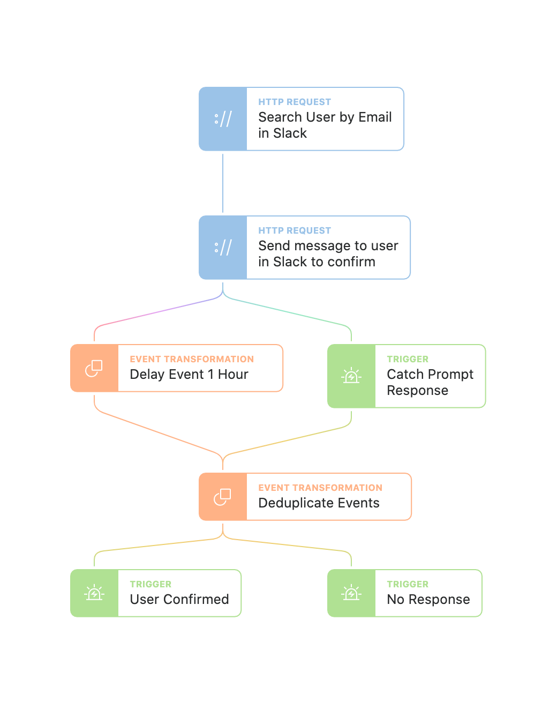

# Prompt Timer
This is an example of prompting a user for an action, but continuing on with a workflow after an hour if a user does not respond. This can be helpful for time sensitive actions like confirming suspicious logins.

