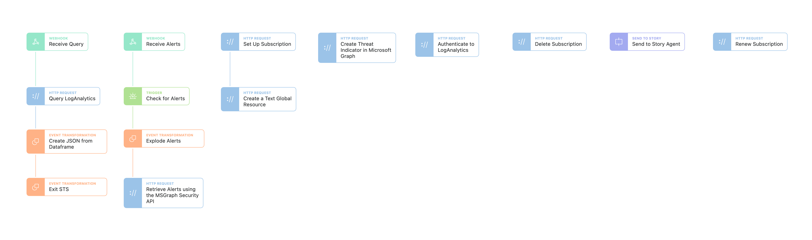

# Azure Sentinel

A story which has three elements to it.

1. Setting up a webhook to receive Microsoft Graph API security alerts when they occur.
2. Querying Log Analytics for logs in the environment and returning the results. Should be enabled for Sent to Story.
3. Submitting Threat Indicators to Azure Sentinel as intelligence that can be used.

