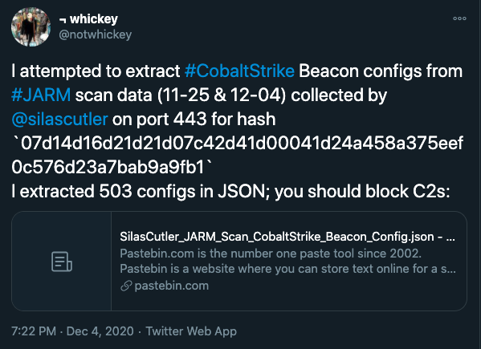
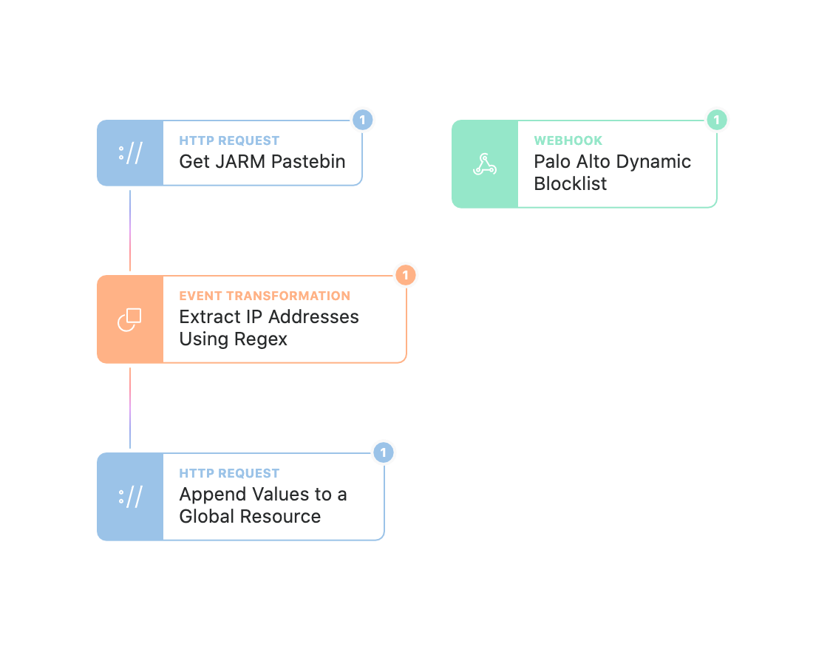

# JARM Blocklist

JARM is an exciting new technique that allows defenders to identify malicious endpoints on the internet and proactively take action against them. Researchers have been providing lists of IoCs related to JARM detected CobaltStrike servers:

Tines allows defenders to easily digest this list and publish a webhook that can be read in by tools like Palo Alto firewalls to have an effective blocklist against these threats.

